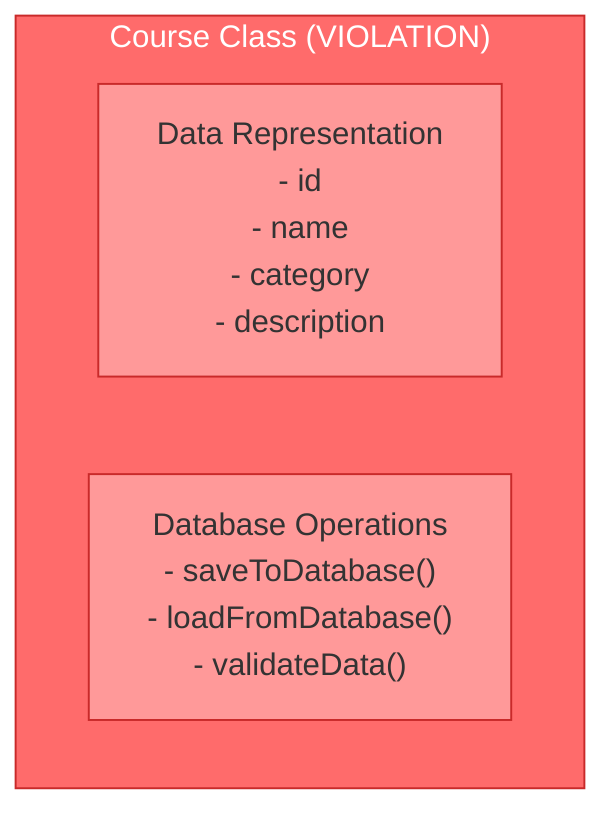
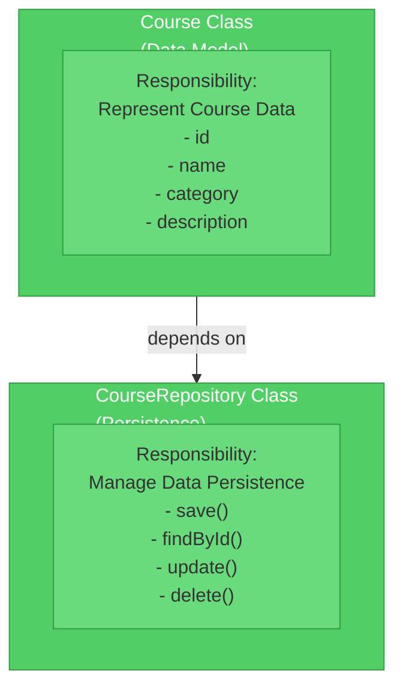
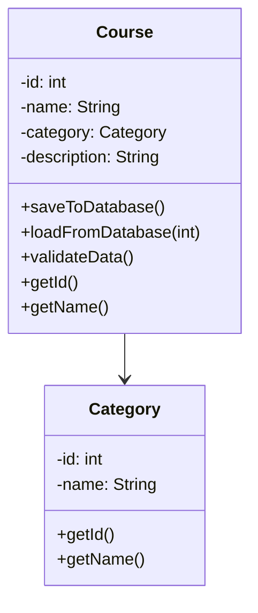
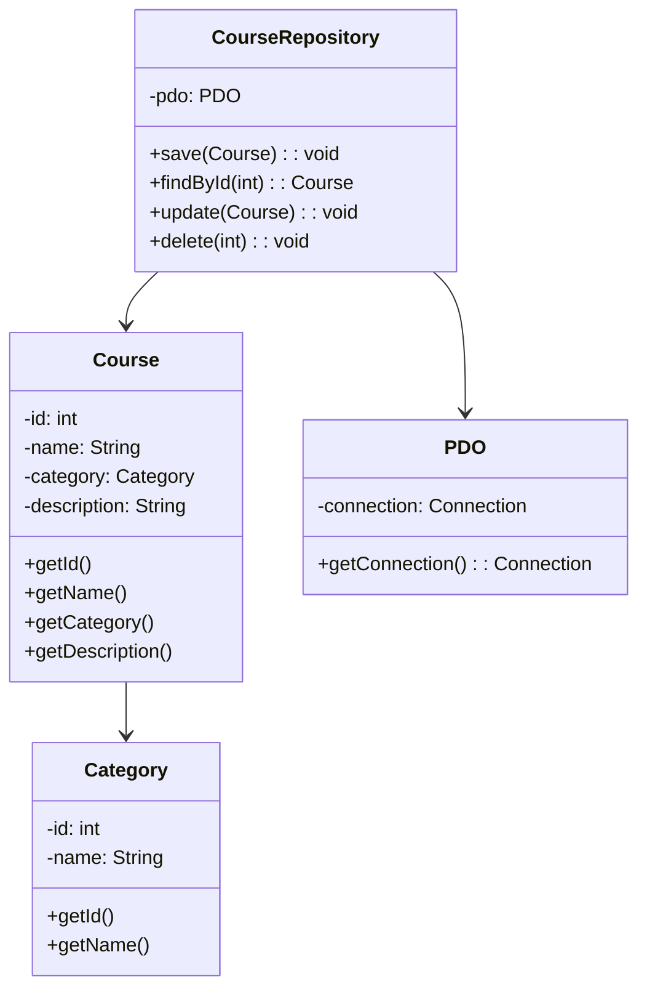
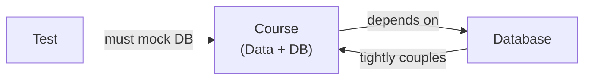
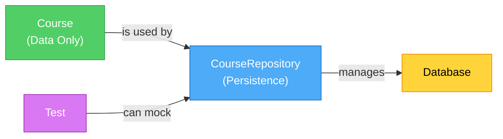
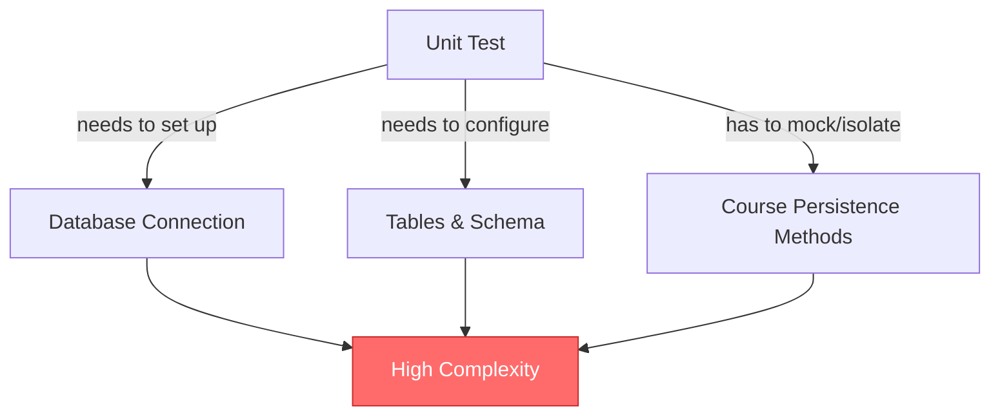
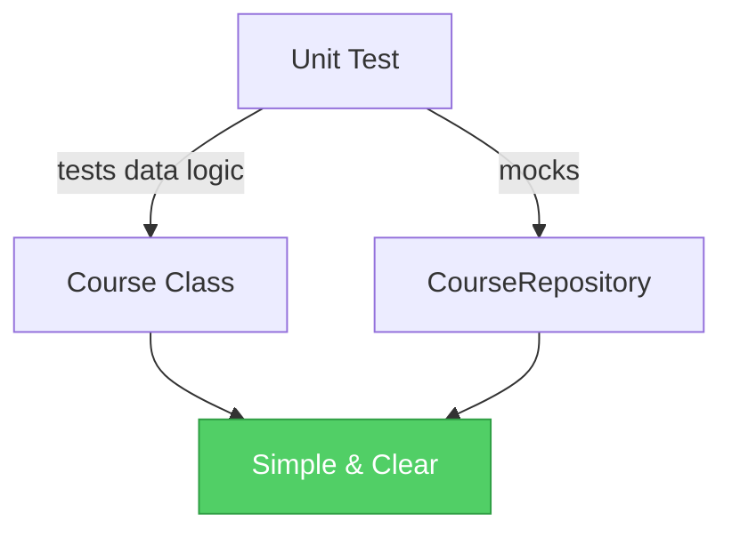

# Single Responsibility Principle (SRP)

## Overview

The **Single Responsibility Principle** is the first principle of SOLID. It states that:

> **A class should have one, and only one, reason to change.**

In other words, a class should have only one primary responsibility or reason for modification. This makes code more maintainable, testable, and flexible.

## Why SRP Matters

### Problems Without SRP

When a class has multiple responsibilities:

- **Difficult to Test**: You need to mock or set up multiple dependencies
- **Hard to Maintain**: Changes in one responsibility affect the entire class
- **Tight Coupling**: Different concerns are tangled together
- **Code Reuse**: Hard to reuse parts of the class independently
- **Unclear Intent**: The class purpose becomes ambiguous

### Benefits of SRP

- **Easier Testing**: Each class can be tested in isolation
- **Better Maintainability**: Changes to one responsibility don't affect others
- **Loose Coupling**: Responsibilities are separated and independent
- **Code Reuse**: Classes can be used independently in different contexts
- **Clear Intent**: Each class has a clear, single purpose

## Visualizing SRP

### ❌ Violating SRP - Bad Design



**Problem**: The `Course` class has **two responsibilities**:
1. Representing course data
2. Managing database persistence

This violates SRP because the class has two reasons to change:
- When domain logic changes (data model)
- When database operations change (persistence strategy)

### ✅ Following SRP - Good Design



**Solution**: Separate concerns into different classes:
1. **Course**: Only represents course data
2. **CourseRepository**: Only handles database persistence

Each class has **one responsibility** and **one reason to change**.

## Class Diagram Comparison

### Bad Implementation Structure



**Issues**:
- `Course` mixed with database logic
- Hard to test without database
- Tightly coupled to database implementation

### Good Implementation Structure



**Advantages**:
- `Course` focuses only on data representation
- `CourseRepository` handles all persistence concerns
- Easy to test (can mock repository)
- Can easily switch database implementations

## Dependency Flow

### Bad Design - Circular Dependencies



### Good Design - Clean Separation



## Testing Impact

### Testing Bad Design



### Testing Good Design



## Real-World Example

### Scenario: Database Migration

**Without SRP** (Bad):
```
Database changes → Must modify Course class → Affects business logic → Need to retest everything
```

**With SRP** (Good):
```
Database changes → Only modify CourseRepository → Course unchanged → Only repository tests affected
```

## Key Takeaways

| Aspect | Without SRP | With SRP |
|--------|------------|----------|
| **Responsibilities per class** | Multiple | One |
| **Reasons to change** | Multiple | One |
| **Testability** | Difficult | Easy |
| **Maintainability** | Hard | Easy |
| **Coupling** | Tight | Loose |
| **Code Reuse** | Limited | High |
| **Clarity** | Ambiguous | Clear |

## In This Repository

This package contains both implementations:

- **`bad/`**: `Course` class violates SRP with database methods
- **`good/`**: `Course` and `CourseRepository` follow SRP with separated concerns

Run both examples to see the difference:
```bash
# Bad implementation
mvn exec:java -Dexec.mainClass="com.solid.srp.bad.BadSRP"

# Good implementation
mvn exec:java -Dexec.mainClass="com.solid.srp.good.GoodSRP"
```

## Further Reading

- **SOLID Principles**: Foundation for maintainable OOP design
- **Separation of Concerns**: Core concept behind SRP
- **Repository Pattern**: Common pattern for applying SRP with persistence
- **Dependency Injection**: Technique for loosely coupling responsibilities
