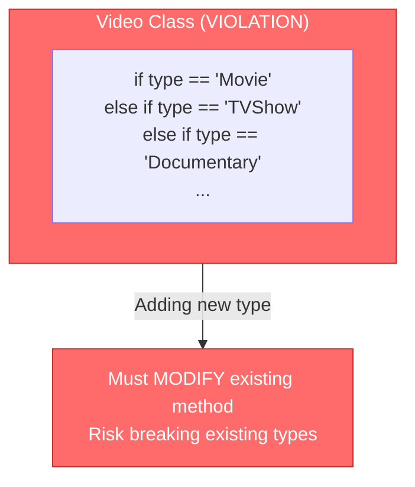
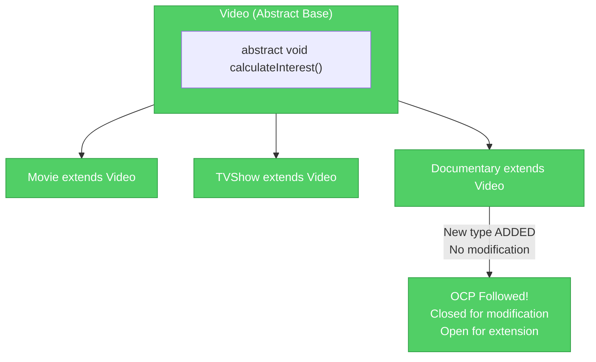
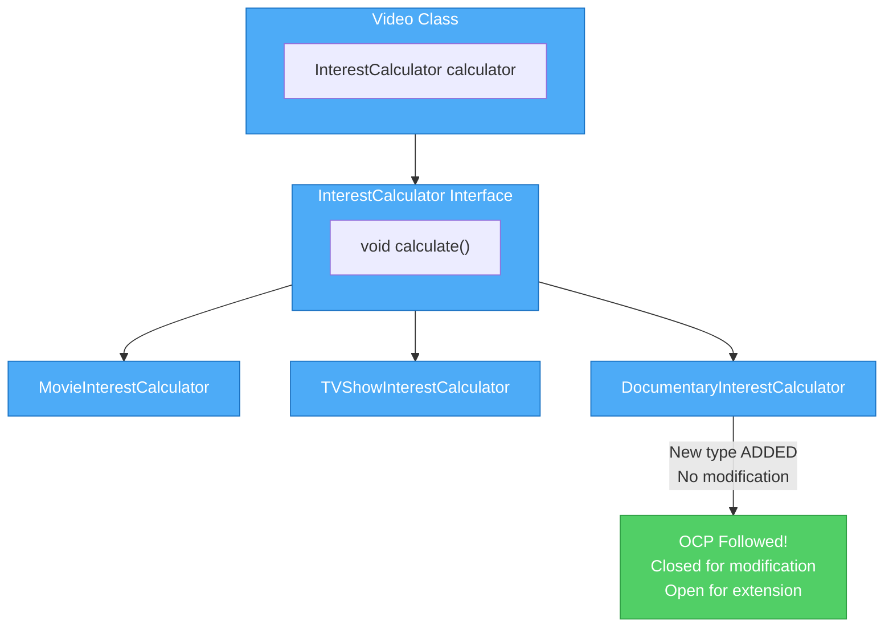
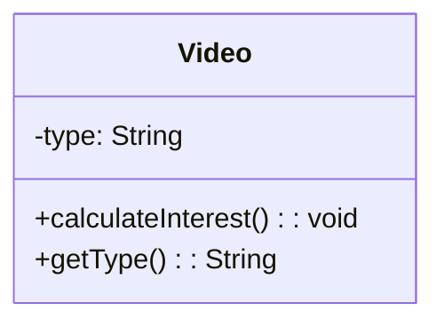
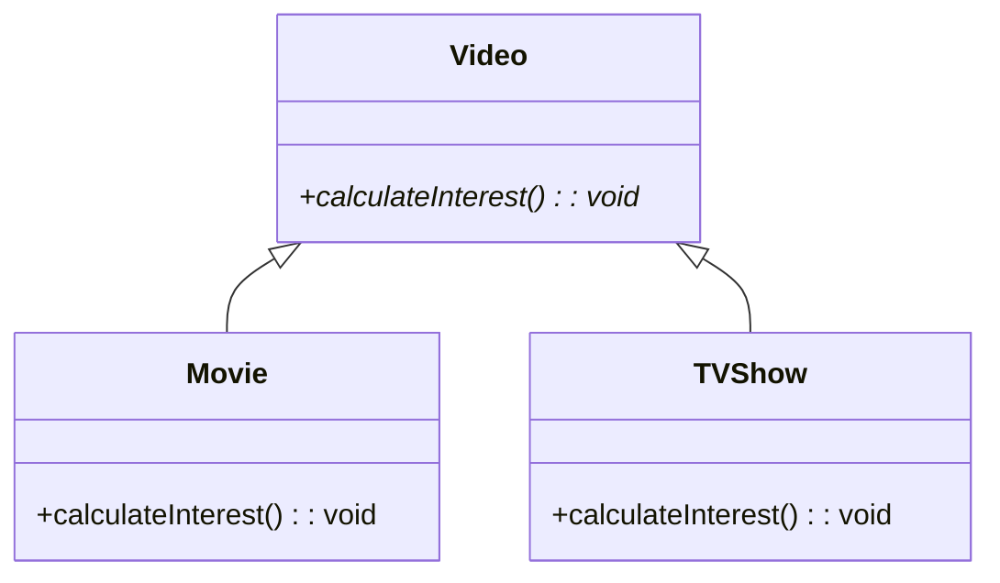
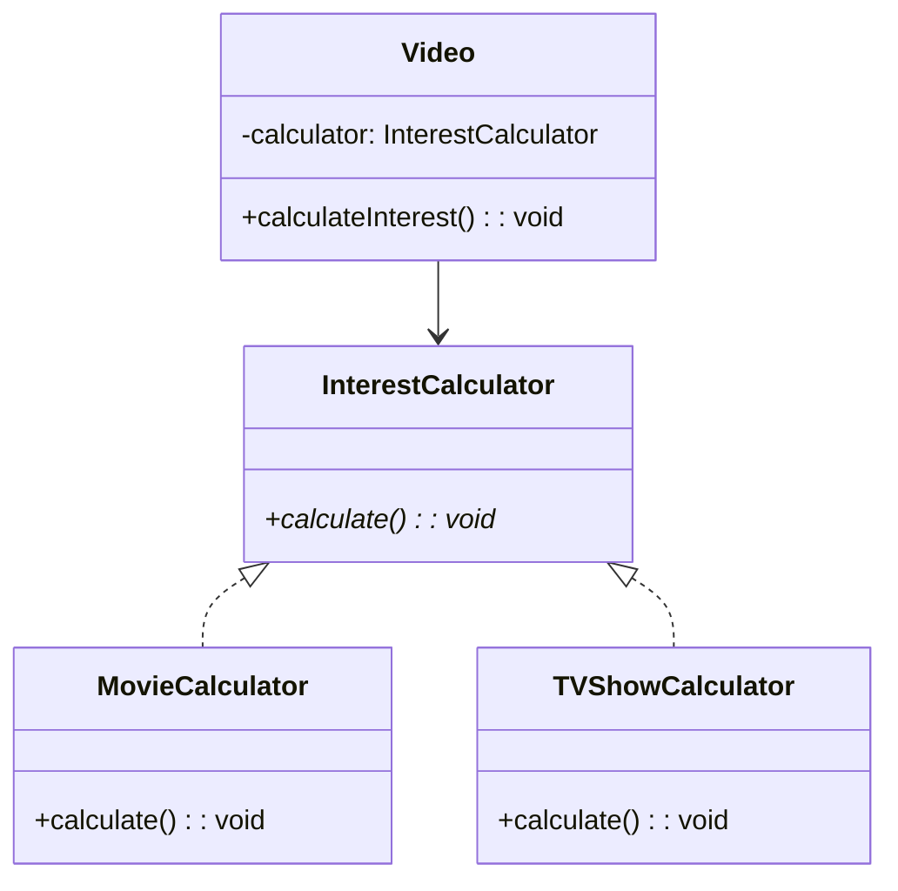
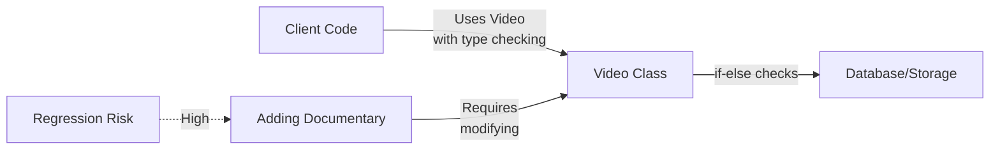
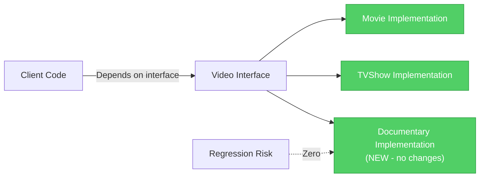
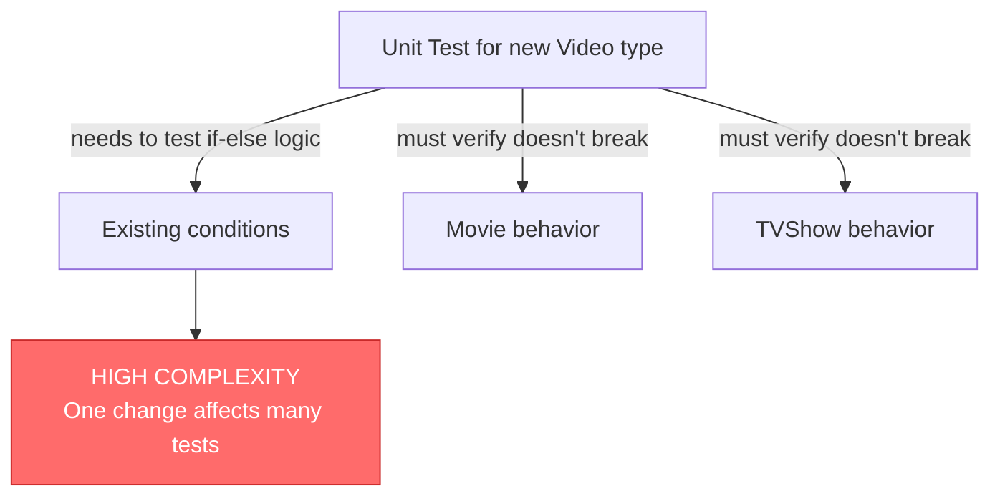
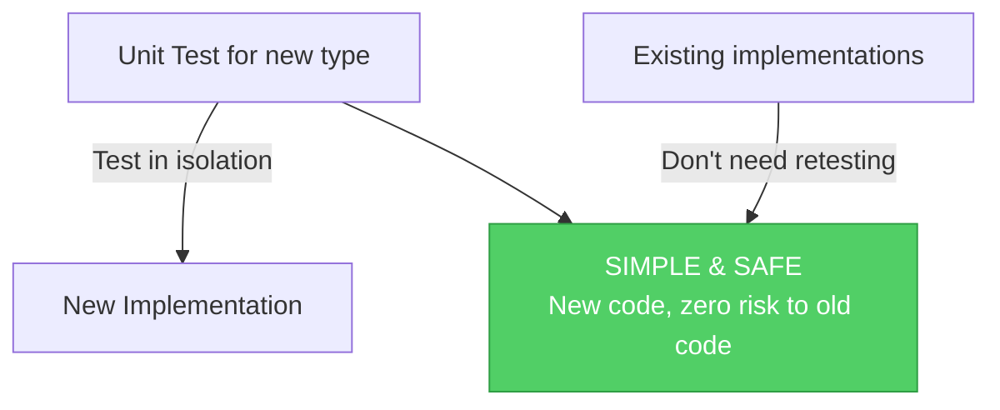

# Open/Closed Principle (OCP)

## Overview

The **Open/Closed Principle** is the second principle of SOLID. It states that:

> **Software entities (classes, modules, functions) should be open for extension but closed for modification.**

In other words, you should be able to add new functionality through extension without changing existing code. This reduces the risk of breaking existing functionality and makes code more maintainable and flexible.

## Why OCP Matters

### Problems Without OCP

When code is not open for extension and closed for modification:

- **Modifying Existing Code**: Adding new features requires changing existing classes
- **Fragile Design**: If-else chains checking types are error-prone and break easily
- **Difficult Testing**: Changes to core logic require retesting everything
- **Cascading Changes**: A single feature addition affects multiple parts of the system
- **Tight Coupling**: Different concerns are mixed together, making code rigid

### Benefits of OCP

When you design code following OCP:

- **Easy Extension**: Add new functionality by creating new classes, not modifying existing ones
- **Reduced Bugs**: Stable, tested code doesn't change, reducing bug introduction risk
- **Better Maintainability**: Each class has a clear, focused purpose
- **Improved Testability**: New implementations can be tested in isolation
- **Flexible Design**: Behavior can be extended or swapped without touching core code

## Visualizing OCP

### ❌ Violating OCP - Bad Design



**Problem**: The `Video` class uses type checking with if-else statements to determine behavior. This violates OCP because:
- To add a new video type, you must modify the existing `calculateInterest()` method
- Every modification risks breaking existing functionality
- No polymorphism - just string-based type checking

### ✅ Following OCP - Good Design (Extension via Inheritance)



**Solution**: Create an abstract base class with concrete implementations. New types extend the base class without modifying existing code.

### ✅ Following OCP - Good Design (Extension via Composition)



**Solution**: Use composition with strategy pattern. Video delegates to an InterestCalculator. New types implement the interface without modifying existing code.

## Class Diagram Comparison

### Bad Implementation Structure



**Issues**:
- Uses string type checking instead of polymorphism
- Adding new type requires modifying `calculateInterest()` method
- Violates OCP - not closed for modification
- Type-checking is error-prone (typos, case sensitivity)

### Good Implementation - Inheritance Approach



**Advantages**:
- Uses polymorphism for behavior variation
- New types added without modifying Video
- Type-safe - compiler enforces implementations
- Extensible - easy to add Documentary, Podcast, etc.

### Good Implementation - Composition Approach



**Advantages**:
- Behavior is pluggable and swappable
- No inheritance hierarchy to manage
- Multiple behaviors can be composed
- Easier to test - can inject mock calculators
- More flexible at runtime

## Extension Approaches for OCP

### Approach 1: Inheritance (Polymorphism)

Uses abstract base classes or interfaces with concrete implementations.

**How it works**:
```java
public abstract class Video {
    public abstract void calculateInterest();
}

public class Movie extends Video {
    @Override
    public void calculateInterest() {
        System.out.println("Calculating Movie interest...");
    }
}

public class TVShow extends Video {
    @Override
    public void calculateInterest() {
        System.out.println("Calculating TV Show interest...");
    }
}
```

**Pros**:
- Simple and straightforward
- Direct polymorphic behavior
- Well-understood by most developers
- Good for "is-a" relationships

**Cons**:
- Java has single inheritance limitation
- Fragile base class problem (base class changes break subclasses)
- Tight coupling between base and derived classes
- Inheritance hierarchy can become complex
- Cannot change behavior at runtime

---

### Approach 2: Composition (Strategy Pattern)

Uses interfaces with delegation and composition.

**How it works**:
```java
public interface InterestCalculator {
    void calculate();
}

public class Video {
    private InterestCalculator calculator;

    public Video(InterestCalculator calculator) {
        this.calculator = calculator;
    }

    public void calculateInterest() {
        calculator.calculate();
    }
}

public class MovieCalculator implements InterestCalculator {
    @Override
    public void calculate() {
        System.out.println("Calculating Movie interest...");
    }
}
```

**Pros**:
- More flexible - can compose multiple behaviors
- No inheritance hierarchy to manage
- Can change behavior at runtime
- Loose coupling - easier to test with mocks
- No fragile base class problems
- Supports multiple behavior composition

**Cons**:
- More classes to create and manage
- Slightly more complex for simple cases
- Requires understanding of composition pattern

---

### Modern Best Practice: Composition Over Inheritance

The Java community and industry leaders strongly recommend **composition over inheritance** for these reasons:

#### Why Composition is Preferred

1. **Runtime Flexibility**: Change behavior at runtime by swapping implementations
   ```java
   Video movie = new Video(new MovieCalculator());
   // Later, change behavior without creating new object
   movie.setCalculator(new SpecialOfferCalculator());
   ```

2. **Avoids Fragile Base Class Problem**: Changes to base class don't break subclasses
   ```java
   // With inheritance: changing Video breaks Movie and TVShow
   // With composition: Video changes don't affect calculators
   ```

3. **Multiple Behavior Composition**: Combine multiple behaviors elegantly
   ```java
   InterestCalculator calculator = new ChainedCalculator(
       new BaseCalculator(),
       new DiscountCalculator(),
       new TaxCalculator()
   );
   ```

4. **Improved Testability**: Easy to inject mock implementations
   ```java
   Video video = new Video(new MockCalculator());
   // Test Video without complex calculator
   ```

5. **Reduces Coupling**: Classes depend on interfaces, not concrete parents
   ```java
   // Good - depends on interface
   public Video(InterestCalculator calculator)

   // Bad - depends on concrete parent
   public Movie extends Video
   ```

#### When to Use Inheritance

Use **inheritance** for true **"is-a"** relationships:
- Dog **is-a** Animal
- Employee **is-a** Person
- Exception **is-a** Throwable

These represent fundamental class hierarchies where the relationship is intrinsic.

#### When to Use Composition

Use **composition** for **"has-a"** relationships and behavior delegation:
- Video **has-a** InterestCalculator (behavior)
- Car **has-a** Engine (component)
- Logger **has-a** FormattingStrategy (behavior)

These represent flexible, swappable, or dynamically-determined relationships.

#### Modern Java Leaders' Recommendation

> **"Favor composition over inheritance"** - Effective Java (Joshua Bloch)

> **"Composition provides better encapsulation and flexibility"** - Design Patterns (Gang of Four)

The modern approach in Java is to use inheritance sparingly for true type hierarchies and prefer composition for adding behavior and flexibility.

## Dependency Flow

### Bad Design - Modification Required



### Good Design - Extension Only



## Testing Impact

### Testing Bad Design



### Testing Good Design



**Benefits**:
- New implementations tested independently
- Existing implementations don't need retesting
- Mock implementations for unit testing
- Integration tests remain stable

## Real-World Example

### Scenario: Adding a New Video Type (Documentary)

**Without OCP** (Bad):
```
Requirement: Support Documentary videos
↓
Must modify Video class
↓
Add else-if condition to calculateInterest()
↓
Must recompile and retest Video class
↓
Must retest Movie and TVShow (regression testing)
↓
Risk of breaking existing functionality
```

**With OCP - Inheritance** (Good):
```
Requirement: Support Documentary videos
↓
Create Documentary extends Video
↓
Implement calculateInterest() for Documentary
↓
No changes to existing code
↓
No regression testing needed
↓
Zero risk to existing functionality
```

**With OCP - Composition** (Better):
```
Requirement: Support Documentary videos
↓
Create DocumentaryCalculator implements InterestCalculator
↓
Pass calculator to Video instance
↓
No changes to existing code or calculators
↓
Can swap calculators at runtime
↓
Maximum flexibility and zero risk
```

## Key Takeaways

| Aspect | Without OCP | With OCP (Inheritance) | With OCP (Composition) |
|--------|------------|----------------------|----------------------|
| **Adding Features** | Modify existing code | Create new class | Create new class |
| **Risk of Breaking Code** | High | None | None |
| **Extension Method** | If-else chains | Polymorphism | Delegation |
| **Runtime Flexibility** | None | Limited | Full |
| **Inheritance Limits** | N/A | Single inheritance | No hierarchy |
| **Testing** | Complex | Straightforward | Easiest |
| **Testability** | Difficult | Good | Excellent |
| **Coupling** | Tight | Loose | Loosest |
| **Modern Acceptance** | ❌ Discouraged | ✅ Good | ✅✅ Best Practice |

## In This Repository

This package contains implementations demonstrating OCP using **inheritance approach**:

- **`bad/`**: `Video` class violates OCP with if-else type checking
- **`good/`**: `Video` abstract class allows extension through subclasses

Run both examples to see the difference:

```bash
# Bad implementation (violates OCP)
mvn exec:java -Dexec.mainClass="com.solid.ocp.bad.BadOCP"

# Good implementation (follows OCP)
mvn exec:java -Dexec.mainClass="com.solid.ocp.good.GoodOCP"
```

## Further Reading

- **Open/Closed Principle**: Foundation for maintainable OOP design
- **Polymorphism**: Core mechanism for OCP implementation via inheritance
- **Strategy Pattern**: Core mechanism for OCP implementation via composition
- **Composition Over Inheritance**: Modern design principle in Java
- **Liskov Substitution Principle**: Works together with OCP for proper inheritance
- **Design Patterns**: Gang of Four book contains pattern implementations of OCP
- **Effective Java**: Item 18 covers composition vs inheritance
